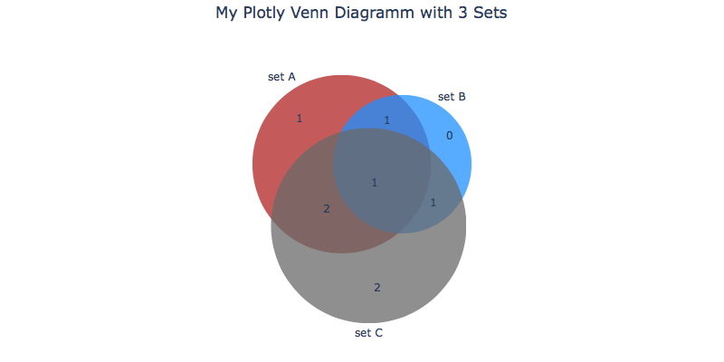

[](https://mybinder.org/v2/gh/ma-blaetke/jupyter_notebooks_data_visualisation/blob/master/matplotlib_venn_to_plotly/master)

This notebook illustrates how to transform a venn diagramm with 2 or 3 sets using ```matplotlib_venn``` into a nice plotly figure.



